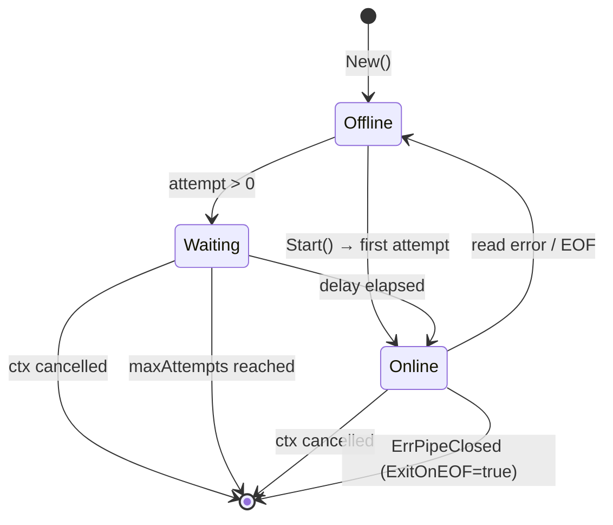

`go-rns-pipe` implements automatic reconnection with two strategies: fixed delay (default) and exponential backoff with jitter.

## State Diagram



## Fixed Delay (Default)

```
attempt 0: connect immediately (no delay)
attempt 1: wait ReconnectDelay (default 5s)
attempt 2: wait ReconnectDelay
attempt N: wait ReconnectDelay
```

Matches `PipeInterface.py` `respawn_delay` behavior. Use this when running as a child process spawned by rnsd.

## Exponential Backoff

Enabled with `Config.ExponentialBackoff = true`:

```
attempt 0: connect immediately
attempt 1: ReconnectDelay * 2^0  ± 25% jitter
attempt 2: ReconnectDelay * 2^1  ± 25% jitter
attempt 3: ReconnectDelay * 2^2  ± 25% jitter
...
attempt N: min(ReconnectDelay * 2^(N-1), 60s) ± 25% jitter
```

**Cap:** 60 seconds maximum delay regardless of attempt number.

**Jitter:** ±25% randomization (uniformly distributed in `[0.75×delay, 1.25×delay]`) prevents thundering-herd reconnects when many clients restart simultaneously.

## Implementation

```go
// backoff computes delay for attempt N.
func (r *reconnector) backoff(attempt int) time.Duration {
    if attempt == 0 {
        return 0 // first attempt: no delay
    }
    if !r.exponentialBackoff {
        return r.baseDelay // fixed delay
    }
    const maxDelay = 60 * time.Second
    exp := math.Pow(2, float64(attempt-1))
    delayF := float64(r.baseDelay) * exp
    if delayF > float64(maxDelay) {
        delayF = float64(maxDelay)
    }
    // ±25% jitter: rand in [0.75, 1.25]
    jitter := time.Duration(delayF * (0.75 + rand.Float64()*0.5))
    return jitter
}
```

## MaxReconnectAttempts

```go
if r.maxAttempts > 0 && attempt > r.maxAttempts {
    return ErrMaxReconnectAttemptsReached
}
```

`MaxReconnectAttempts = 0` (default): infinite retries.

`MaxReconnectAttempts = N`: allows N retries after the first failure. `Start` returns `ErrMaxReconnectAttemptsReached` when exhausted.

## ErrPipeClosed Terminal Case

`ErrPipeClosed` is not retried — it signals a clean, intentional pipe close by rnsd:

```go
if errors.Is(err, ErrPipeClosed) {
    return err // terminal: don't retry
}
```

## Online/Offline Transitions

The `OnStatus` callback is called on every state change:

| Event | Called with |
|-------|-------------|
| `Start` establishes connection | `true` |
| Read error triggers reconnect | `false` |
| Reconnect establishes connection | `true` |
| Context cancelled | `false` |

The callback runs synchronously inside the state transition — keep it non-blocking.
