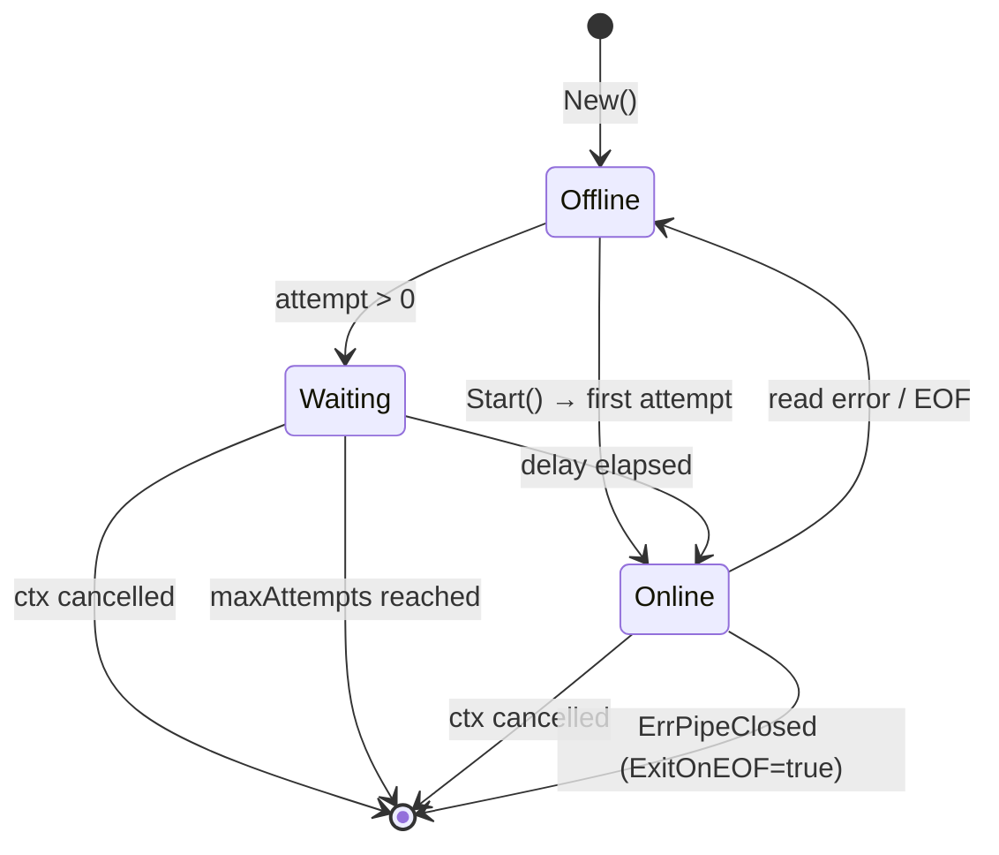

`go-rns-pipe` реализует автоматическое переподключение с двумя стратегиями: фиксированная задержка (по умолчанию) и экспоненциальный откат с джиттером.

## Диаграмма состояний



## Фиксированная задержка (по умолчанию)

```
attempt 0: connect immediately (no delay)
attempt 1: wait ReconnectDelay (default 5s)
attempt 2: wait ReconnectDelay
attempt N: wait ReconnectDelay
```

Воспроизводит поведение `respawn_delay` в `PipeInterface.py`. Используйте при работе в качестве дочернего процесса, запущенного rnsd.

## Экспоненциальный откат

Включается через `Config.ExponentialBackoff = true`:

```
attempt 0: connect immediately
attempt 1: ReconnectDelay * 2^0  ± 25% jitter
attempt 2: ReconnectDelay * 2^1  ± 25% jitter
attempt 3: ReconnectDelay * 2^2  ± 25% jitter
...
attempt N: min(ReconnectDelay * 2^(N-1), 60s) ± 25% jitter
```

**Ограничение:** максимальная задержка — 60 секунд вне зависимости от номера попытки.

**Джиттер:** ±25% случайизация (равномерное распределение в `[0.75×delay, 1.25×delay]`) предотвращает эффект «стада» при одновременном переподключении множества клиентов.

## Реализация

```go
// backoff computes delay for attempt N.
func (r *reconnector) backoff(attempt int) time.Duration {
    if attempt == 0 {
        return 0 // first attempt: no delay
    }
    if !r.exponentialBackoff {
        return r.baseDelay // fixed delay
    }
    const maxDelay = 60 * time.Second
    exp := math.Pow(2, float64(attempt-1))
    delayF := float64(r.baseDelay) * exp
    if delayF > float64(maxDelay) {
        delayF = float64(maxDelay)
    }
    // ±25% jitter: rand in [0.75, 1.25]
    jitter := time.Duration(delayF * (0.75 + rand.Float64()*0.5))
    return jitter
}
```

## MaxReconnectAttempts

```go
if r.maxAttempts > 0 && attempt > r.maxAttempts {
    return ErrMaxReconnectAttemptsReached
}
```

`MaxReconnectAttempts = 0` (по умолчанию): бесконечные повторы.

`MaxReconnectAttempts = N`: разрешает N повторов после первого сбоя. `Start` возвращает `ErrMaxReconnectAttemptsReached` после исчерпания.

## Терминальный случай ErrPipeClosed

`ErrPipeClosed` не вызывает повторных попыток — он сигнализирует о намеренном, чистом закрытии пайпа со стороны rnsd:

```go
if errors.Is(err, ErrPipeClosed) {
    return err // terminal: don't retry
}
```

## Переходы онлайн/офлайн

Обратный вызов `OnStatus` вызывается при каждом изменении состояния:

| Событие | Вызывается с |
|---------|-------------|
| `Start` устанавливает соединение | `true` |
| Ошибка чтения запускает переподключение | `false` |
| Переподключение устанавливает соединение | `true` |
| Контекст отменён | `false` |

Обратный вызов выполняется синхронно внутри перехода состояния — сделайте его неблокирующим.
